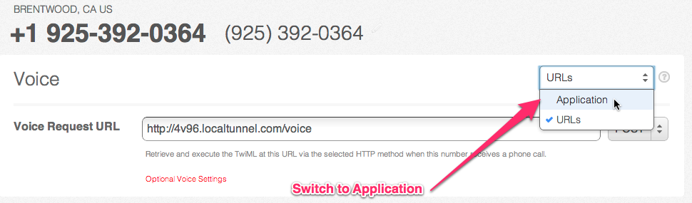

.. _callin:

Radio Call In
=============

In this workshop we'll be designing a radio call in application using Twilio's
<Queue> functionality. While we'll be using a radio show as our target, this
style of queue management can be used for any phone number where many people
may call at the same time.

There will be two numbers, one for calls coming in and one for the DJ. The DJ
will call in to connect to the waiting callers one at a time. Once the DJ is
finished with a caller, he or she will press # to move onto the next caller.

Prerequisites
-------------

The next sections assume a working knowledge of Twilio. You should be familiar
with TwiML, configuring Twilio phone numbers, and the Twilio application model.

Also, we assume you are comfortable writing web applications. For
reference, we'll be developing the application along the way using Python
and Google App Engine.

Make sure you have a second Twilio number.

Using the Twilio Helper Libraries
---------------------------------

Though this workshop will assume use of Python and the ``twilio-python`` helper
library, Twilio offers helper libraries for a large set of languages. If you
aren't using Python, download the `helper library`_ for your language of
choice. You'll need the library in the next section.

For the ``twilio-python`` helper library, you may find the `Queue API
Reference`_ helpful for this workshop.

.. _helper library: http://www.twilio.com/docs/libraries
.. _Queue API Reference: https://twilio-python.readthedocs.org/en/latest/api/rest/resources.html#queues

Using <Queue>
-------------

We'll need two Twilio phone numbers to work with Queue - one for the DJ to
dequeue calls from, and one for the listener to call into.

First, we'll enqueue calls via TwiML. In the example below, we enqueue calls
into a queue named ``radio-callin-queue``. Note that queues are created on
<Enqueue> if they do not already exist.

.. code-block:: xml

    <?xml version="1.0" encoding="UTF-8"?>
    <Response>
        <Say>You are being enqueued now.</Say>
        <Enqueue>radio-callin-queue</Enqueue>
    </Response>

Here is an example App Engine application that serves the above TwiML.

.. code-block:: python

   import webapp2
   from twilio import twiml

   class EnqueueHandler(webapp2.RequestHandler):

       def get(self):
           self.response.headers['Content-Type'] = 'application/xml'

           resp = twiml.Response()
           resp.say("You are being enqueued now.")
           resp.enqueue("radio-callin-queue")
           self.response.write(str(resp))

   app = webapp2.WSGIApplication([
       ('/twiml/enqueue', EnqueueHandler),
   ], debug=True)

We are going to use a TwiML Application to connect this TwiML with
your listener queue number. We'll need to create an `Application
<http://www.twilio.com/docs/api/rest/applications>`_ for the browser to call
into. You can think of an Application kind of like a phone number; it's an
entry point for incoming calls. Configure the Voice URL of your new Application
to point to the TwiML above.

You want to connect your listener queue function to your Application. From the
`Numbers <https://www.twilio.com/user/account/phone-numbers/incoming>`_ tab of
your Dashboard, select the number you are going to use for your Listener Queue.
Then from the dropdown select "Application", then point to your new
Application.

Go ahead and try calling your number now. You should hear the Twilio default
wait music.

We can spice up our TwiML endpoint by adding some custom wait music, using the
``waitUrl`` parameter.

.. code-block:: xml

    <?xml version="1.0" encoding="UTF-8"?>
    <Response>
        <Say>You are being enqueued now.</Say>
        <Enqueue waitUrl="/twiml/wait" waitUrlMethod="GET">
          radio-callin-queue
        </Enqueue>
    </Response>

Twilio will request ``/twiml/wait`` endpoint and process the TwiML there,
which plays music. The ``waitUrl`` TwiML document only supports a `subset of
TwiML verbs`_, including ``<Say>`` and ``<Play>``.

.. code-block:: python
   :emphasize-lines: 12

   import webapp2
   from twilio import twiml

   class EnqueueHandler(webapp2.RequestHandler):

       def get(self):
           self.response.headers['Content-Type'] = 'application/xml'

           resp = twiml.Response()
           resp.say("You are being enqueued now.")
           resp.enqueue("radio-callin-queue",
               waitUrl="/twiml/wait", waitUrlMethod="GET")
           self.response.write(str(resp))

   app = webapp2.WSGIApplication([
       ('/twiml/enqueue', EnqueueHandler),
   ], debug=True)

The ``/twiml/wait`` endpoint will return TwiML that plays hold music for the
queue.

.. code-block:: xml

    <?xml version="1.0" encoding="UTF-8"?>
    <Response>
        <Say>Please hold.</Say>
        <Play>http://com.twilio.sounds.music.s3.amazonaws.com/MARKOVICHAMP-Borghestral.mp3</Play>
        <Redirect/>
    </Response>

We use the redirect verb at the bottom of the page so once the hold music has
finished, Twilio will re-request the same URL and make sure the music doesn't
stop.

You can use this Python snippet with AppEngine to output the TwiML above.

.. code-block:: python
   :emphasize-lines: 9-20, 24

   import webapp2
   from twilio import twiml

   class EnqueueHandler(webapp2.RequestHandler):

       def get(self):
           # Same as above

   class WaitHandler(webapp2.RequestHandler):
   
       def get(self):
           self.response.headers['Content-Type'] = 'application/xml'
           
           resp = twiml.Response()
           resp.say("Please hold.")
           resp.play("http://com.twilio.music.rock.s3.amazonaws.com/nickleus_-_"
                     "original_guitar_song_200907251723.mp3")
           self.response.out.write(str(resp))

   app = webapp2.WSGIApplication([
       ('/twiml/enqueue', EnqueueHandler),
       ('/twiml/wait', WaitHandler),
   ], debug=True)

Now your listener queue number should play hold music while callers are in the
queue.

For the DJ dequeuing number, we use TwiML that bridges the current call to the
queue. Note that <Dial>ing into a queue dequeues the front of the queue (the
person who has been waiting longest), while the only way to get into a queue is
by using the <Enqueue> verb.

.. code-block:: xml

    <?xml version="1.0" encoding="UTF-8"?>
    <Response>
        <Dial>
            <Queue>radio-callin-queue</Queue>
        </Dial>
    </Response>

You will want to create a second Twilio Application for your DJ number, and
configure that application's Voice URL to point to the TwiML above.

.. code-block:: python
   :emphasize-lines: 14-24, 27

   import webapp2
   from twilio import twiml

   class EnqueueHandler(webapp2.RequestHandler):

       def get(self):
           # Same as above

   class WaitHandler(webapp2.RequestHandler):
   
       def get(self):
           # Same as above

   class DequeueHandler(webapp2.RequestHandler):
   
       def get(self):
           self.response.headers['Content-Type'] = 'application/xml'
           
           resp = twiml.Response()
           d = resp.dial()
           d.queue("radio-callin-queue")

           self.response.out.write(str(resp))

   app = webapp2.WSGIApplication([
       ('/twiml/dequeue', DequeueHandler),
       ('/twiml/enqueue', EnqueueHandler),
       ('/twiml/wait', WaitHandler),
   ], debug=True)

Now, the DJ can call the DJ dequeuing number, and will automatically be
connected to the first member on the queue.

By now, you may be wondering how to properly test this application. With two
phone numbers, you need to fill up your queue with waiting callers. To help you
fill your queue, we've created an application that will call a given number
with fake callers, allowing you to easily simulate real users calling in. The
application can be found at http://queuetester.herokuapp.com/.

.. _subset of TwiML verbs: http://www.twilio.com/docs/api/twiml/enqueue#attributes-waitUrl

Dynamic Queue Information
-------------------------

Twilio's Queue exposes dynamic information about the queue state that
you can use to build rich applications. In this section, we'll move past
static TwiML applications and start using the data Queue gives you to
create dynamic TwiML through a web application.

We'll start by working on our hold music. Wouldn't it be cool if we could tell
users where they were in the queue, how long they've been there, or even the
average wait time for their queue? Twilio sends these parameters via POST data
when invoking your application's waiting logic via HTTP.

================ ===========
Parameter 	 Description
================ ===========
QueuePosition 	 The current queue position for the enqueued call.
QueueSid 	 The SID of the Queue that the caller is in.
QueueTime 	 The time in seconds that the caller has been in the queue.
AvgQueueTime An average of how long time the current enqueued callers has been in the queue.
CurrentQueueSize The current number of enqueued calls in this queue.
================ ===========

Utilizing this information, we can inform our users what position they are in
the queue and how long they can expect to wait before an answer.

Remember to change the ``waitUrlMethod`` from ``GET`` to ``POST`` now that we are using
``POST`` data for the ``waitUrl``

.. code-block:: python
   :emphasize-lines: 12, 15-22

   import webapp2
   from twilio import twiml

   class EnqueueHandler(webapp2.RequestHandler):

       def get(self):
          self.response.headers['Content-Type'] = 'application/xml'

          resp = twiml.Response()
          resp.say("You are being enqueued now.")
          resp.enqueue("radio-callin-queue",
              waitUrl="/twiml/wait", waitUrlMethod="POST")
          self.response.write(str(resp))

   class WaitHandler(webapp2.RequestHandler):
       def post(self):
           response = twiml.Response()
           response.say("You are number %s in line." % self.request.get('QueuePosition'))
           response.say("You've been in line for %s seconds." % self.request.get('QueueTime'))
           response.say("The average wait time is currently %s seconds." % self.request.get('AvgQueueTime'))
           response.play("http://com.twilio.music.rock.s3.amazonaws.com/nickleus_-_original_guitar_song_200907251723.mp3")
           self.response.out.write(str(response))

   class DequeueHandler(webapp2.RequestHandler):
   
       def get(self):
           # Same as above

   app = webapp2.WSGIApplication([
       ('/twiml/dequeue', DequeueHandler),
       ('/twiml/enqueue', EnqueueHandler),
       ('/twiml/wait', WaitHandler),
   ], debug=True)

You can also take advantage of similar information when a call is dequeued
through the ``action`` parameter when enqueuing.

.. code-block:: xml

    <?xml version="1.0" encoding="UTF-8"?>
    <Response>
        <Say>You are being enqueued now.</Say>
        <Enqueue action="http://example.com/dequeue-logic">radio-callin-queue</Enqueue>
    </Response>

Twilio will fetch the ``action`` url and execute the TwiML received on the
caller's end before he or she is bridged to the other call.

Handling Long Queue Times
-------------------------

We can use the ``action`` parameter to collect all sorts of useful metrics
on the back end, or even issue hasty apologies for long queue wait times.

Let's try to implement some small features on our dequeue action call to
let our users know we care. Using the `action URL parameters`_, we can
send an SMS apology if the wait time exceeded 30 seconds, or if their
call was rejected from a full queue.

Here is some stub code that may help, if you are taking the Python / Google
App Engine route.

.. code-block:: xml

    <?xml version="1.0" encoding="UTF-8"?>
    <Response>
        <Say>You are being enqueued now.</Say>
        <Enqueue action="http://example.com/dequeue-logic">radio-callin-queue</Enqueue>
    </Response>

.. code-block:: python

    import webapp2
    class DequeueLogic(webapp2.RequestHandler):
        def post(self):
            
            # ... FILL ME IN ...
            # res = self.request.get('QueueResult')

    app = webapp2.WSGIApplication([('/dequeue-logic', DequeueLogic)], debug=True)

.. _action URL parameters: http://www.twilio.com/docs/api/twiml/enqueue#attributes-action-parameters
.. _helper library documentation: https://twilio-python.readthedocs.org/en/latest/api/rest/resources.html#sms-messages
.. _language of choice: http://www.twilio.com/docs/libraries

Closing Out the Queue
---------------------

Unfortunately, all good things must come to an end. It's time for our radio
show to close down until next time - but what about the people still on the
waiting queue?

We can use `Queue`_ and `Member`_ REST API resources to programmatically look
at all of our account's queues and active members on those queues.

Let's write a quick HTTP endpoint that will loop through our queue members, and
dequeue each of them with a thank you message.

Then, we can iterate over its members and dequeue with some static thank you
TwiML. Try it yourself! Hint: issuing `an HTTP POST to a Member instance`_ will
dequeue that member.

.. code-block:: python

    import urllib
    import webapp2

    from twilio import TwilioRestClient

    message_url = ('http://twimlets.com/message?' + 
                   urllib.quote_plus('Sorry, the queue is now closed.'))

    class DequeueEveryone(webapp2.RequestHandler):
        def get(self):
            client = TwilioRestClient(ACCOUNT_SID, AUTH_TOKEN)
            # Should only have one queue, but let's make sure.
            for queue in client.queues.list():
                for member in queue.queue_members.list():
                    queue_members.dequeue(message_url, member.sid)

Finally, we can delete the queue using a REST API call.

.. code-block:: python

    my_queue.delete()

Advanced Features
------------------

That is the end of the content for this tutorial. If you still have some time,
try implementing some of these advanced features:

- Allowing the callers being dequeued to record a message for the DJs to listen to at the beginning of the next show.
- other features

.. _Queue: http://www.twilio.com/docs/api/rest/queue
.. _Member: http://www.twilio.com/docs/api/rest/member
.. _find our queue: https://twilio-python.readthedocs.org/en/latest/usage/queues.html
.. _an HTTP POST to a Member instance: http://www.twilio.com/docs/api/rest/member#instance-post
