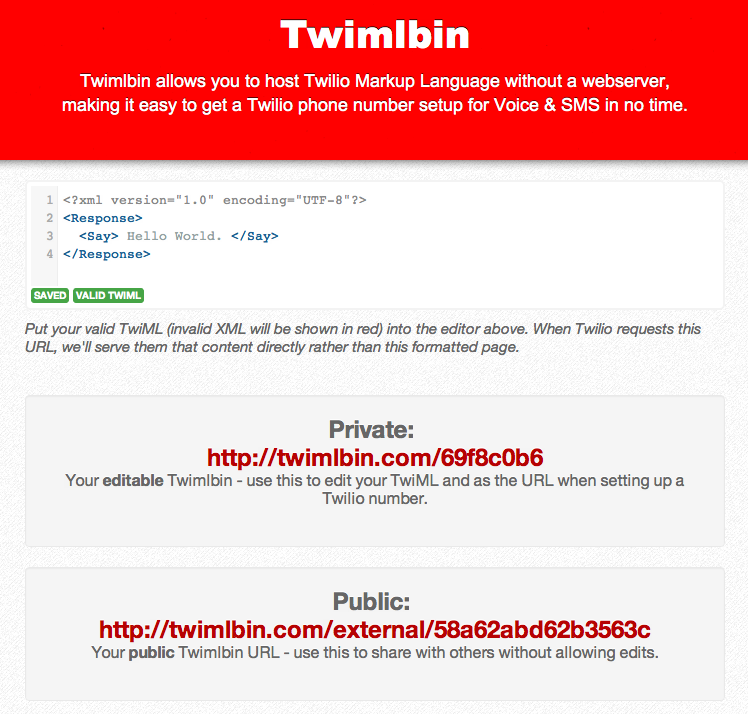
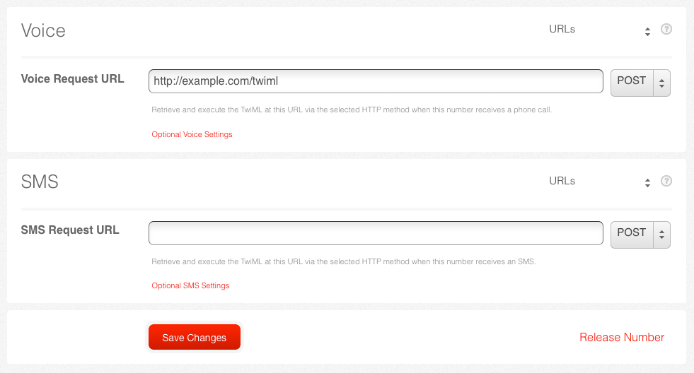

.. _custom_twiml:

Introduction to TwiML
=======================

We've successfully made a phone ring, but how do we actually control call flow?
`TwiML <https://www.twilio.com/docs/api/twiml>`_ is the
answer. TwiML is a set of instructions you can use to tell Twilio what to do
when you receive an incoming call or SMS.
     
When someone makes a call or sends an SMS to one of your Twilio numbers, Twilio
will look up the URL associated with that phone number and make a request to
that URL. Twilio will read TwiML instructions at that URL to determine what to
do: record the call, play a message for the caller, prompt the caller to press
digits on their keypad, etc.

TwiML is an XML-based language and consists of five basic verbs for Voice calls.

* Say_
* Play_
* Gather_
* Record_
* Dial_

And one basic verb for SMS messaging.

* Sms_

To see how these verbs work, let's first take a look at the last section. When we
called your phone, a robot answered with a "Hello World" message. We now know
that TwiML powered that call, so let's take a look. Open
http://twimlets.com/message?Message[0]=Hello+World in your browser.

Notice the TwiML used for this application. This application uses the `Say`_ verb 
and says "Hello World" with a text-to-speech engine. For outgoing calls, we choose 
the TwiML URL at the time of the call. For incoming calls, we set a TwiML URL that 
is fetched each time someone calls into your Twilio number.

Twimlbin
----------

TwiML can be hosted anywhere. It can be a static XML document or created
dynamically by a web application. To make developing Twilio applications
easier, you can host your TwiML on `Twimlbin`_. Applications with Twimlbin 
will autosave and let you know when there might be potential errors with
your TwiML. While we love Twimlbin, we recommend that you host your Twilio
production application on your own se   rver. 

Let's rebuild the "Hello World" greeting in `Twimlbin`_.

To create a new bin, go to the Twimlbin homepage and click "Create a new
Twimlbin". 

Now let's write our "Hello World" application with the following code.

.. code-block:: xml

    <?xml version="1.0" encoding="UTF-8"?>
    <Response><Say>Hello World</Say></Response>

Your final application should look like this.

.. _configure-number:

Configuring your phone number
------------------------------

Once you're done building your application, we'll want to configure your Twilio
phone number. By configuring our Twilio phone number, whenever an incoming call
is received on this number, Twilio will fetch the TwiML that is located at that
URL.

First, we'll need to copy the "Public" URL of your Twimlbin.

Go to `your Twilio numbers page
<https://www.twilio.com/user/account/phone-numbers/incoming>`_ and click on
your Twilio phone number. Change the "Voice URL" field to your Twimlbin URL and
"Save Changes"

Now give your Twilio number a call! You should hear a "Hello World" greeting.

Call Logs & SMS Logs
---------------------

Now you're probably thinking:

* How long did that call last?
* How much did that call cost?
* What time was the call made?

All this information and more can be found in your `Call Logs`_. 

Let's head over to your `Call Logs`_ by clicking on the Logs tab from your
Account Dashboard.

You'll notice that the call duration is listed as 1. Call durations with Twilio
are rounded up to the nearest minute. 

You SMS Messages logs can also be found under the subheader `SMS Messages
<https://www.twilio.com/user/account/log/sms>`_

Have any questions about your Logs? Ask your TA!

Debugger
---------

Let's rebuild your application. This time, use the following link as your Voice
Request URL.

.. code-block:: bash

    http://twimlets.com/echo?Twiml=%3CResponse%3E%3CSay%3EHello+World.%3C%2FSay%3E%3CResponse%3E

Call your phone number. You should hear a recorded message that says "We're
sorry, an application error has occurred".

Now let's find out why your application error has occured. The first place
we'll want to look is the `debugger
<https://www.twilio.com/user/account/debugger>`_. Navigate to your account
dashboard and find your debugger. 

.. note:: 

   Your debugger can also be found under the 'Dev Tools' tab.

Click on the error to see more detail. 

The Debugger lets you know where in your application Twilio ran into an error.
This page is broken down into two sections.

- The `Request <http://www.twilio.com/docs/api/twiml/twilio_request>`_ section
  provides information on the data Twilio sent to your server.
- The `Response
  <http://www.twilio.com/docs/api/twiml/your_response>`_ section lets you know
  how your server responded to Twilio. Twilio will always expect correctly
  formated TwiML as a response. If your application tries to respond to Twilio
  with anything else, you will likely run into an error.

Find the error within the response your application sent to Twilio. What should
it look like?

*Hint: You may also click on the more information link at the top of the page.*

Additional Information
-----------------------
- `TwiML: the Twilio Markup Language <https://www.twilio.com/docs/api/twiml>`_
- `Twilio's Voice Request <http://www.twilio.com/docs/api/twiml/twilio_request>`_
- `Your Voice Response <http://www.twilio.com/docs/api/twiml/your_response>`_
- `Twilio's SMS Request <http://www.twilio.com/docs/api/twiml/sms/twilio_request>`_
- `Your SMS Response <http://www.twilio.com/docs/api/twiml/sms/your_response>`_
- `Debugging <http://www.twilio.com/docs/errors>`_

.. _Sms: https://www.twilio.com/docs/api/twiml/sms
.. _Dial: https://www.twilio.com/docs/api/twiml/dial
.. _Say: https://www.twilio.com/docs/api/twiml/say
.. _Play: https://www.twilio.com/docs/api/twiml/play
.. _Record: https://www.twilio.com/docs/api/twiml/record
.. _Gather: https://www.twilio.com/docs/api/twiml/gather
.. _Call Logs: https://www.twilio.com/user/account/log/calls
.. _Twimlbin: http://twimlbin.com

