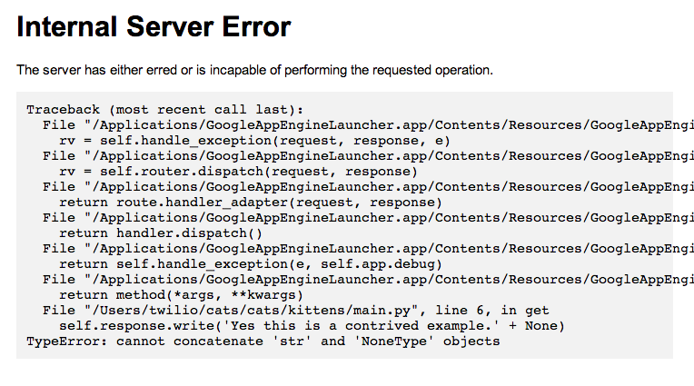
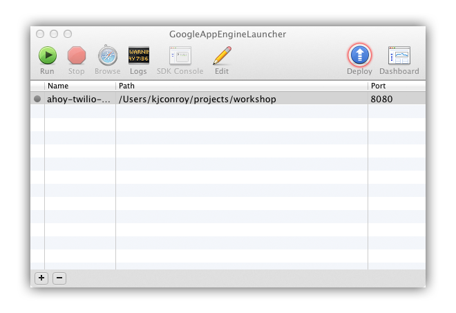

.. _dynamic_apps:

Building Dynamic Applications
=============================

We've built awesome Twilio applications in the last two sections, but we've
been limited to static TwiML. The true power of Twilio can only be unlocked by
using a web application.

This section assumes you've completed the :ref:`setup` and have the Google App Engine
SDK running locally on your computer.

Your first web application
--------------------------

The first part of the guide walked you through running a sample application.
Before continuing make sure that example is running and you have "Hello World"
displayed in your browser. If you can't remember how to run the sample app,
refer back to :ref:`setup`

Before we can write our web application we need to understand the Hello World
example. Let's go through the example line-by-line and how it works. Inside our
``main.py`` file:

.. literalinclude:: ../main.py
   :language: python
   :lines: 1

This line is the first part of our application. We use the `webapp2
<http://webapp-improved.appspot.com/>`_ module to create our web application
so we must do an import before we can use it in our code.

.. literalinclude:: ../main.py
   :language: python
   :lines: 3-6

This code handles incoming requests to our application at the specified URL.
Whenever a user makes a request to our application, this is the code that
will be run. The output of the code gets displayed to the web browser.

Here we only define a single method on the class called ``get``. If you
remember your HTTP verbs from the :ref:`http` section this method name
corresponds to an HTTP GET. We'll show later how to handle different HTTP
verbs, such as POST or DELETE.

.. literalinclude:: ../main.py
   :language: python
   :lines: 8-

Here we actually create our application. In the `webapp2` framework web
applications are a mapping of URLs to request handler classes. The above
mapping says "Whenever someone visits the front page of my application, process
that request using the HelloWorld request handler class".

Your first task will be to change the message displayed in your browser. Open
up ``main.py`` in your text editor and change the "Hello World" message on line
6 to "Hello TwilioCon". Refresh the page to see your new message.

Congratulations! You've just created your first web application.

Responding with TwiML
---------------------

A simple message is great but we want to use our application to serve TwiML.
How do we respond with TwiML instead of plain text?  First let's change the
message we respond with to valid TwiML.

.. code-block:: python
   :emphasize-lines: 6

   import webapp2
    
   class HelloWorld(webapp2.RequestHandler):
    
       def get(self):
           self.response.write('<Response><Say>Hello TwilioCon</Say></Response>')
    
    
   app = webapp2.WSGIApplication([
       ('/', HelloWorld),
   ], debug=True)

When someone requests the front page of our application, they will now get TwiML
instead of HTML. However, if you refresh your page, nothing seems to have
changed. The problem is that while we're sending back TwiML the browser still
thinks we're sending it HTML. To fix this problem we'll include additional
metadata via an HTTP header to tell the browser we're sending valid TwiML.

.. code-block:: python
   :emphasize-lines: 6

   import webapp2
    
   class HelloWorld(webapp2.RequestHandler):
    
       def get(self):
           self.response.headers['Content-Type'] = "application/xml"
           self.response.write('<Response><Say>Hello TwilioCon</Say></Response>')

   app = webapp2.WSGIApplication([
       ('/', HelloWorld),
   ], debug=True)

When you refresh the page, you should now see the entire TwiML response (and it
may even be highlighted and formatted).

Using the Twilio Helper Library
~~~~~~~~~~~~~~~~~~~~~~~~~~~~~~~

Manually writing TwiML soon becomes very tiresome. If you miss a single ending
tag your entire application can break. Instead we'll use the ``twilio-python``
helper library to generate TwiML for us. This way we won't have to worry about
messing up the syntax.

.. code-block:: python
   :emphasize-lines: 2, 9-11

   import webapp2
   from twilio import twiml
    
   class HelloWorld(webapp2.RequestHandler):
    
       def get(self):
           self.response.headers['Content-Type'] = "application/xml"

           response = twiml.Response()
           response.say("Hello TwilioCon")
           self.response.write(str(response))

   app = webapp2.WSGIApplication([
       ('/', HelloWorld),
   ], debug=True)

When you refresh your page nothing should look different. The helper library
code we just wrote is equivalent to the static TwiML we had before. Let's
explain what the added code is actually doing.

.. code-block:: python

   response = twiml.Response()

Here we create a new Response object. We'll add additional TwiML verbs using
methods on this object. We also use this object to output our TwiML into a
string.

.. code-block:: python

   response.say("Hello TwilioCon")

This methods adds a Say verb to the response. There are similar methods on the
response object for Play, Gather, Record, and Dial. We've already covered these
verbs in the previous sections.

.. code-block:: python

   self.response.write(str(response))

Here we turn our response object into a string using Python's built in string
function. We then write this string to the response object.

The Weather Channel
-------------------

So far all our responses look the same. We're just returning static TwiML as we
did that the last two sessions. Now we're about to show you why building a
dynamic application is so powerful. Instead of saying read a message, we'll
inform the caller of the current weather in his or her zipcode.

.. code-block:: python
   :emphasize-lines: 2,10,11,14,15

   import webapp2
   from util import current_weather
   from twilio import twiml
    
   class HelloWorld(webapp2.RequestHandler):
    
       def get(self):
           self.response.headers['Content-Type'] = "application/xml"

           weather = current_weather(self.request.get("FromZip", "94117"))
           city = self.request.get("FromCity", "San Francisco")

           response = twiml.Response()
           response.say("Hello from " + city)
           response.say("The current weather is " + weather)
           self.response.write(str(response))

   app = webapp2.WSGIApplication([
       ('/', HelloWorld),
   ], debug=True)

Now visit your page. You'll see the following message.

.. code-block:: xml

    <?xml version="1.0" encoding="UTF-8"?>
    <Response>
      <Say>Hello from San Francisco</Say>
      <Say>The current weather is Partly Cloudy, 65 F</Say>
    </Response>

It seems that our message is missing a phone number. To test out the greeting,
add the ``From`` parameter to your URL.

.. code-block:: bash

    http://localhost:8080/?From=15005550000

You should now see the phone number show up in your TwiML response.

.. code-block:: xml

    <?xml version="1.0" encoding="UTF-8"?>
    <Response>
      <Say>Hello 15005550000</Say>
    </Response>

Whenever an HTTP request is sent to your application it includes data in query
string and body of the request. The code we added when constructing the Say
verb pulls the named request parameter from either a POST or GET request
parameter.

.. code-block:: python

   self.request.get('From')

Incoming Twilio Data
~~~~~~~~~~~~~~~~~~~~

Adding this parameter to your URL mimics the request that Twilio will send to
your server. All TwiML requests made by Twilio include additional information
about the caller. Here is short list of some of the data that Twilio will send
your way.

=============== ===========
Parameter       Description
=============== ===========
``From``        The phone number or client identifier of the party that initiated the call. 
``To``          The phone number or client identifier of the called party.
``CallStatus``  A descriptive status for the call. The value is one of queued, ringing, in-progress, completed, busy, failed or no-answer
``FromCity``    The city of the caller.
``FromState``   The state or province of the caller.
``FromZip``     The postal code of the caller.
``FromCountry`` The country of the caller.
=============== ===========

Phone numbers are formatted in E164 format (with a '+' and country code, e.g.
`+1617555121`).

For a complete list check out `Twilio request parameters  
<http://www.twilio.com/docs/api/twiml/twilio_request#synchronous-request-parameters>`_ 
on the Twilio Docs

Handling Server Errors
--------------------------------------------

Oh no, application error what should I do??

Don't panic if you see this, the program usually give you hints as to what gone
wrong. Try reading the stack trace it will tell you what error the application
has run into and where it occurred. 

Some errors may also appear on the AppEngine logs. If the errors on the browser
aren't too informative, try clicking on the Logs button on the AppEngine
Launcher.

.. TODO: maybe we should include a screen capture of where the Logs button is on the AppEngine launcher. I wanna make the 
.. red circles but I probably can't make it the same as what we have on the Initial Setup guide

Deploy your Twilio application
------------------------------

We're now ready to hook up your brand new application to a Twilio number. Open
the Google App Engine Launcher application, highlight your application, and hit
the "Deploy" button. A window will pop up and show you the status of your
deployment. It should take less than a minute to deploy.

Once it's deployed, take the URL for your application,
``http://<your-application-name>.appspot.com`` and set it as the voice number
for your Twilio phone number. Configuring Twilio numbers is covered in more
detail in :ref:`configure-number`

.. note:: 

   Since we have only implemented the GET endpoint, be sure to configure your
   number to use the GET method instead of the default POST*

Now give it a call. You should hear your custom message. Hooray!
