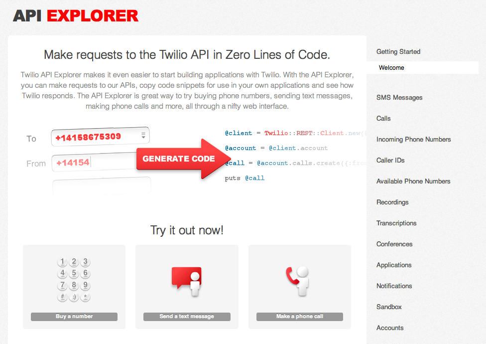

.. _hello_world:

Hello World
===========

The first thing we'll do today is explore Twilio's REST API calls. Soon, you'll
see how SMS and phone calls can be originated from your web browser with Twilio.

Twilio Account Portal
---------------------

When you log into your Twilio Account, the first page you come across is
your Account Dashboard. This is where your Account Sid and Auth Token are
displayed.

.. image:: _static/bar.png
	:class: screenshot

These are your account credentials. The Account Sid acts as a username and the 
Auth Token acts as a password. Twilio uses your Account Sid and Auth Token to 
authenticate the API requests made by your application. 

Analytics about your Voice and SMS application are also shown here. We'll go
over these after we've made some calls and sent some SMS messages.

At the bottom of your Account Dashboard is the API Explorer and the Debugger. 

Twilio API Explorer
-------------------

The `API Explorer`_ is a helpful application built into the Account Dashboard that allows you to easily try out Twilio's API without getting into the details of scripting and :ref:`HTTP <http>` calls.

You can get to the `API Explorer`_ from the botton of your Account Dashboard. You may also click on the `Dev Tools <https://www.twilio.com/user/account/developer-tools/api-explorer>`_  tab to access the API Explorer. 

Getting Account Information
^^^^^^^^^^^^^^^^^^^^^^^^^^^

<<<<<<< HEAD
Head over to the `API Explorer`_ and let's try it out by `sending an SMS message <https://www.twilio.com/user/account/developer-tools/api-explorer#POST/2010-04-01/Accounts/[AccountSid]/SMS/Messages.[format]>`_. 
=======
Let's start of with a basic request for your account information. Go to your Twilio Account Portal, click on `Dev Tools`, then click on `Accounts` (on the right near the bottom), then click on `View Account`.

Go ahead and click on the `Make Request` button. A response with your Account information should appear at the end of the page. 

**Ok, so what did we just do?**

Let's take a look at the key parts of the request we just made:

.. code-block:: bash

	GET /2010-04-01/Accounts/AC000.xml

This command is specially formatted to function on the command line. Lets break that down a bit:

- **GET**: this line tells curl to make a ``GET`` request, meaning that the intent of this call is to retrieve information from the server.
- **/2010-04-01/Accounts/AC000.xml**: this is the endpoint for retrieving Account data from the Twilio API. Lets break it down further:
	- **/2010-04-01/** is the version of the API that we want to request. The version of the API we want to talk to is important because we want to make sure that the way we talk to the API doesn't change. If Twilio makes a major change to how to talk to the API the version will change, but the old version will continue to work the same way so that your application doesn't break.
	- **Accounts/AC000.xml** means that we want to retrieve an Account resource for the account "AC000" and that we want the response in XML format.
	
Now lets look at the response. The server responded with an XML formatted representation of your account information.

Sending an SMS
^^^^^^^^^^^^^^

Let's send a text message using the `API Explorer`_. Go to your Twilio `Account Portal`_, click on `Dev Tools`, then click on `SMS Messages`, then on `Send SMS`.
>>>>>>> ca8d5a1bc8561250878127831b4eb30e6811a985

All the fields required to send an SMS are visible.

============ ==========
Parameter    Definition
============ ==========
`Format`     The `Format` field tells the API what format we want Twilio to response with. For our purposes this isn't important right now. You can request the response in either `XML`_ or `JSON`_ format.
`AccountSid` The `AccountSid` field tells the API which Twilio Account will send the SMS message. This is pre-populated with your account.
`From`       The `From` field tells the API which phone number to use to send the Message. This can only be one of the phone numbers you've purchased or ported into Twilio.
`To`         The `To` field tells the API where to send the message. The phone number should be in `E.164`_ format. Twilio will assume that `To` phone numbers without a "+" will have the same country code as the `From` phone number.
`Body`       The body is a freeform field to enter your message. You can enter a message up to 160 characters long.
============ ==========

Enter your cell phone number in the `To` field along with a text message `Body`, and click the `Make Request` button at the bottom of the page. This will send the information you've just entered and pass onto Twilio. You will be prompted to confirm the use of funds from your account. Aren't you glad you got the Promo credit?

Twilio will process the information you have submitted and your phone will receive a text message shortly.

**So how was that different from our Accounts information request?**

Lets take a look at the key parts of this request:

.. code-block:: bash

	POST /2010-04-01/Accounts/AC000/SMS/Messages.xml
	
There are a few key differences to note:

- **POST** tells curl to make a ``POST`` request, meaning that the purpose of this request is to pass data in to the API for the purposes of modifying the ``SMS Messages`` resource.
- **Parameters**: if you **-d 'From=xxx'*** et al... tell curl what data to pass to the API. You can see each entry you modified in the form is represented here. You'll also notice that each entry contains special characters (ie: ``%2B`` instead of ``+``). This is called `Url Encoding`_ and is required to make sure that special characters are properly transmitted to the API.

Making a Phone Call
^^^^^^^^^^^^^^^^^^^

Now let's make a phone call using the `API Explorer`_. Click on the Calls link on the left hand sidebar, then on the sublink `"Make call" <https://www.twilio.com/user/account/developer-tools/api-explorer#POST/2010-04-01/Accounts/[AccountSid]/Calls.[format]>`_.

============ ==========
Parameter    Definition
============ ==========
`Format`     The `Format` field tells the API what format we want Twilio to response with. For our purposes this isn't important right now. You can request the response in either `XML`_ or `JSON`_ format.
`AccountSid` The `AccountSid` field tells the API which Twilio Account will make the call. This is prepopulated with your account.
`From`       The `From` field tells the Twilio API which phone number to use to make the call. This can be a number that you've purchased from Twilio or any phone number that you've validated on your account.
`To`         The `To` field tells the API what phone number to call. The phone number should be in `E.164`_ format or be a valid Twilio Client ID. Twilio will assume that `To` phone numbers without a "+" will have the same country code as the `From` phone number.
`Url`        The `Url` field tells the API where to load TwiML instructions for handling the call. `TwiML`_ is a set of instructions that tells Twilio what to do. Don't worry, we'll get more into TwiML later. 
============ ==========

Enter your cell phone number in the `To` field. To make things easy, we're going to use a `Twimlet`_ for the `Url`. We'll get into the details of building TwiML later on. For now, copy the url below into the `Url` field.

.. code-block:: bash

	http://twimlets.com/message?Message=Hello+World

Click on the `Make Request` button at the bottom of the page. Again, the information you've submitted are sent off to Twilio and your phone should start ringing momentarily.

Have any questions? Ask your TA!

Additional Information
----------------------
- `TwiML: the Twilio Markup Language <http://www.twilio.com/docs/api/twiml>`_
- `Twilio REST API - Calls Resource <http://www.twilio.com/docs/api/rest/call>`_
- `Twilio REST API - SMS/Messages Resource <http://www.twilio.com/docs/api/rest/sms>`_

.. _API Explorer: https://www.twilio.com/user/account/developer-tools/api-explorer
.. _Account Dashboard: https://www.twilio.com/user/account 
.. _XML: http://en.wikipedia.org/wiki/XML
.. _JSON: http://en.wikipedia.org/wiki/JSON
.. _E.164: http://en.wikipedia.org/wiki/E.164
.. _TwiML: http://www.twilio.com/docs/api/twiml
.. _Twimlet: https://www.twilio.com/labs/twimlets
.. _Url Encoding: http://en.wikipedia.org/wiki/Percent-encoding
