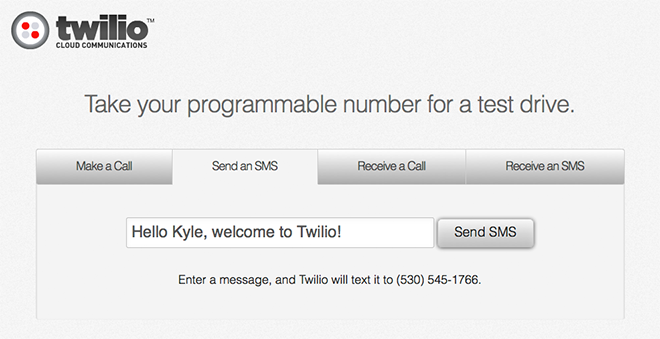

.. _quickstart:

Twilio Quickstart
=================

The next section will take you on a whirlwind tour of the features of the
Twilio API. You'll learn how to make phones ring, send text messages, and
record voice messages. 

Make sure you've completed the :ref:`setup` section before continuing.

Create a Twilio Account
-----------------------

First, `sign up`_ for a free Twilio account. You won't need a credit card, but
you will need a phone number to prove you aren't a robot. Once you've signed
up, you'll have your own Twilio phone number. We'll use this number for the
rest of the workshop.

.. _sign up: https://www.twilio.com/try-twilio

After you've created your account and verified your phone number, you should
end up at a screen that looks like this.

This is your first chance to test out what Twilio can do. Send yourself a text
message and receive a call. Congratulations, you've used Twilio for the first
time!

However, how would you do this from your own code? I'm glad you asked.

Hello World - SMS
-----------------

Let's send a text message using Python and the Twilio REST API. Open the
``send_sms.py`` file in your text editor. First, replace the dummy account
credentials with those of your own. Your account credentials can be found `on
the top of your Twilio account dashboard <https://www.twilio.com/user/account>`_.

.. literalinclude:: ../send_sms.py
   :lines: 1-4

On the next line, set `TO_NUMBER` to the number you used to sign up
with Twilio. During your free trial, you're only allowed to make calls and send
messages to numbers you've verified.

set `from_number` to your new Twilio number. if you
can't remember it, check the `numbers
<https://www.twilio.com/user/account/phone-numbers/incoming>`_ section of your
account dashboard.

pick any message less than 140 characters to serve as the body.

.. literalinclude:: ../send_sms.py
   :lines: 6-8

With the above information, we construct a Twilio REST API client. We'll use
this to create and send a new text message.

.. literalinclude:: ../send_sms.py
   :lines: 10-

We're now ready to send a SMS message.

.. code-block:: bash

    $ python send_sms.py

Your phone should be getting a message in a few seconds.

Hello World - Voice
-------------------

It's time to make a call to your phone using the REST API. 
Open ``make_call.py`` in your text editor and, just like the last section,
fill in your account credentials and phone numbers details.

With the above information, we construct a Twilio REST API client and create a
new call.

.. literalinclude:: ../make_call.py
   :lines: 8-

Run the script to start the call.

.. code-block:: bash

    $ python make_call.py

Your phone should start ringing momentarily.

Introduction to TwiML
---------------------

We've successfully made a phone ring, but how do we actually control call flow?
`TwiML <https://www.twilio.com/docs/api/twiml>`_ is the
answer. TwiML is a set of instructions you can use to tell Twilio what to do
when you receive an incoming call or SMS.
     
When someone makes a call or sends an SMS to one of your Twilio numbers, Twilio
will look up the URL associated with that phone number and make a request to
that URL. Twilio will read TwiML instructions at that URL to determine what to
do: record the call, play a message for the caller, prompt the caller to press
digits on their keypad, etc.

TwiML is an XML-based language and consists of five basic verbs.

* Say_
* Play_
* Gather_
* Record_
* Dial_

To see how these verbs work, let's take a look at the last section. When we
called your phone, a robot answered with a "Hello World" message. We now know
that TwiML powered that call, so let's take a look. Open
http://twimlets.com/message?Message[1]=Hello+World in your browser.

.. code-block:: xml

    <?xml version="1.0" encoding="UTF-8"?>
    <Response><Say>Hello World</Say></Response>

This TwiML will do text-to-speech and say "Hello World". For outgoing calls, we
choose the TwiML URL at the time of the call. For incoming calls, we set a
TwiML URL that is fetched every time someone calls into our Twilio number.

Go to `your Twilio numbers page <https://www.twilio.com/user/account/phone-numbers/incoming>`_ and click on your phone number. Change the "Voice URL" field to the Hello World URL

.. code-block:: bash

    http://twimlets.com/message?Message[1]=Hello+World

Now when you call your number, you should hear a "Hello World" greeting.

Twimlbin
~~~~~~~~

TwiML can be hosted anywhere. It can be a static XML document or created
dynamically by a web application. To make developing Twilio applications
easier, you can host your TwiML on `Twimlbin <http://twimlbin.com/>`_.

To create a new bin, go to the Twimlbin homepage and click "Create a new
Twimlbin". You can then use set your phone number's Voice URL to the "Public"
URL of your Twimlbin.

For the next sections, copy the sample TwiML and paste it into your Twimlbin
for easy experimentation.

Call Forwarding
---------------

The `Dial`_ verb allows you to connect calls to other people. The following
TwiML will forward any call to your Twilio phone number to your personal. Once
you've wired up this TwiML to your number, get a neighbor to test it out. 

.. code-block:: xml

    <?xml version="1.0" encoding="UTF-8"?>
    <Response>
      <Say>Please wait while we forward your call</Say>
      <Dial>YOUR PHONE NUMBER</Dial>
    </Resposne>

Voice Mailbox
-------------

Recording audio is accomplished through the `Record`_ verb. The Record verb
will play a beep and wait until a user presses # or hangs up. Copy this TwiML
into your bin and save. You can now leave messages on your number.

.. code-block:: xml

    <?xml version="1.0" encoding="UTF-8"?>
    <Response>
      <Say>After the beep, record your message</Say>
      <Record/>
    </Resposne>

After you're done recording your message, hang up. Twilio begins processing the
recording right after your done. Head to your `recording log
<https://www.twilio.com/user/account/log/recordings>`_ to listen to your
message.

Private Conference Line
-----------------------

Many times during project assignments, you just need to get everyone on the
same page. You can now have your own private conference line using the
Conference noun and Dial verb. Put the following TwiML into your bin and save.
Give your Twilio number to a few people around you. Have everyone call in and
start up a conversation.

.. code-block:: xml

    <?xml version="1.0" encoding="UTF-8"?>
    <Response>
      <Dial>
        <Conference>vip</Conference>
      </Dial>
    </Resposne>

Swiss-Army Phone Number
-----------------------

Equipped with the knowledge of TwiML, you can now bend your Twilio phone number
to your will. You've forwarded a call, recorded a message, and started a
private conference line. Your phone is now your's to control.

But don't think we're done yet, our second act will be creating application for
:ref:`voting`.

Additional Information
----------------------

- `Twilio REST API - Calls Resource <https://www.twilio.com/docs/api/rest/call>`_
- `Twilio REST API - SMS/Messages Resource <https://www.twilio.com/docs/api/rest/sms>`_
- `Twilio TwiML <https://www.twilio.com/docs/api/twiml>`_

.. _Dial: https://www.twilio.com/docs/api/twiml/dial
.. _Say: https://www.twilio.com/docs/api/twiml/say
.. _Play: https://www.twilio.com/docs/api/twiml/play
.. _Record: https://www.twilio.com/docs/api/twiml/record
.. _Gather: https://www.twilio.com/docs/api/twiml/gather
