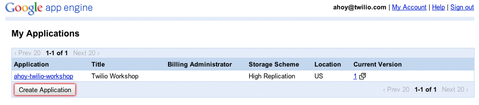
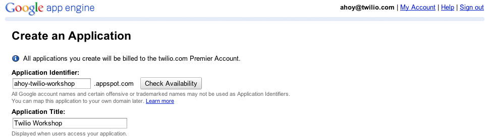

.. _setup:

Initial Setup
=============

Before we start the workshop, we're going to need to make sure we have a few
things. This guide assumes you have nothing currently set up on your computer.
Feel free to skip any sections you've already completed.

This guide will also setup your computer to build web applications using
Google App Engine. If you're planning on using a different development stack
during the workshop, please make sure it meets the `deployment requirements`_.
We want to make sure everyone can easily and quickly develop on Twilio during
the day.

Create a Twilio Account
-----------------------

First, `sign up`_ for a free Twilio account. You won't need a credit card, but
you will need a phone number to prove you aren't a robot. Once you've signed
up, you'll have your own Twilio phone number. We'll use this number for the
rest of the workshop.

**Make sure to use the promo code you were provided for the workshop.**

.. _sign up: https://www.twilio.com/try-twilio

After you've created your account and verified your phone number, you should
end up at a screen that looks like this.

.. image:: _static/testdrive.png

This is your first chance to test out what Twilio can do. Send yourself a text
message and receive a call. Congratulations, you've used Twilio for the first
time!

Download Workshop Materials
---------------------------

Download and unzip the `workshop materials
<https://github.com/twilio/workshop/zipball/master>`_. You can also clone this
repository if you have git installed.

.. code-block:: bash

   $ git clone https://github.com/twilio/workshop.git

Install a Text Editor
---------------------

Now that you've signed, up, we need to make sure you can edit the workshop
code. **If you already have a text-editor or IDE of choice, skip this section**.

- Windows - Download and install `Notepad++`_
- OS X - Download and install `Text Wrangler`_
- Linux - Install gedit via your package manager
- Any Platform - Download and install `Sublime Text`_ functional demo

.. _Text Wrangler: http://www.barebones.com/products/textwrangler/
.. _Notepad++: http://notepad-plus-plus.org/
.. _Sublime Text: http://www.sublimetext.com/

Install Python
--------------

Open up Terminal or command prompt window and type the following command. If
you aren't sure how launch your command prompt, ask a TA or a neighbor help.

.. code-block:: bash

   $ python --version

If the output contains Python 2.7.x, your Python installation is ready to go.

Find and download the installation for your operating system.

- `Python 2.7.3 Windows Installer <http://www.python.org/ftp/python/2.7.3/python-2.7.3.msi>`_
- `Python 2.7.3 Windows X86-64 Installer <http://www.python.org/ftp/python/2.7.3/python-2.7.3.amd64.msi>`_
- `Python 2.7.3 OS X Installer <http://www.python.org/ftp/python/2.7.3/python-2.7.3-macosx10.6.dmg>`_
- `Python 2.7.3 compressed source tarball <http://www.python.org/ftp/python/2.7.3/Python-2.7.3.tgz>`_

More downloads are available on the `Python downloads <http://www.python.org/download/>`_ page.

Once you are finished, opening up Terminal (OS X) or Powershell (Windows) and
verify the output is now the same

.. code-block:: bash

   $ python --version
   Python 2.7.3

Install the App Engine SDK
--------------------------

We'll be deploying our Twilio applications to Google App Engine during the
workshop. `Google App Engine` provides an easy and free way to host your code.
Download the SDK for your operating system below. After downloading the
installer, double click it and follow the on screen instructions.

- `App Engine SDK Windows Installer <http://googleappengine.googlecode.com/files/GoogleAppEngine-1.7.2.msi>`_
- `App Engine SDK OS X Installer <http://googleappengine.googlecode.com/files/GoogleAppEngineLauncher-1.7.2.dmg>`_
- `App Engine SDK Linux/Other Platforms <http://googleappengine.googlecode.com/files/google_appengine_1.7.2.zip>`_

Aside from the App Engine SDK, you'll also need to sign up for an App Engine
account. If you already have a Google account, you're ready to go. If not, sign
up `here <http://appengine.google.com>`_.

On your `App Engine dashboard  <http://appengine.google.com>`_, click "Create
Application"

You'll need to pick a name and title for your application. I'd suggest a name
of the form ``{lastname}-twilio-workshop``.

Accept the terms and conditions and click "Create Application"

Basic Application Setup
~~~~~~~~~~~~~~~~~~~~~~~

The workshop directory you downloaded earlier contains a basic web application 
that we'll be extending during the workshop. We'll use this location to perform local testing and the code we edit here we'll later deploy to `Google App Engine`. To do this We need to tell the `Google App Engine Launcher` where to find our files.

Open the `Google App Engine Launcher` and from the file menu select `Add 
Existing Application…` In the next dialog click the `Browse` button and 
locate the workshop folder. 

Click `Add` to finish setting up the application.

Run the Web Application
~~~~~~~~~~~~~~~~~~~~~~~

To run your application, open the `Google App Engine Launcher`. Select your 
application from the list and click the `Browse` button. Your app will launch 
in a browser window.

In your text editor let's open up the file ``main.py`` at the root level of the workshop directory. Change the work "World" to your name and save the file. Return to the web browser and refresh the window to see your change.

Debugging your Application
~~~~~~~~~~~~~~~~~~~~~~~~~~

Quite often while developing applications you will encounter errors in your code. The `Google App Engine Launcher` helps you deal with these errors by exposing helpful log information when running hte local development environment.

Open the `Google App Engine Launcher`. Select your application from the list and click the `Logs` button. This will launch a console that outputs activity from your local development environment.

Your application's access and error logging information will show up in this window as you reload the web browser to see your changes.

Deploy your Application
~~~~~~~~~~~~~~~~~~~~~~~

App Engine sites require a configuration file to run. Inside your workshop 
directory there is a file named ``app.yaml``. There are a few configuration 
directives in this file but at this time we only need to be concerned with the 
Application Name. Replace the ``helloworld`` portion of ``application: 
helloworld`` with the application name you registered and save the file.

Open the `Google App Engine Launcher`, highlight your application if it is not already highlighted and then click the `Deploy` button. The Launcher app will upload your code and deploy it.

Once you see ``Completed update of app: {your-application-name}, version: 1`` 
your application is ready to view. Open a browser window and go to 
``http://{your-application-name}.appspot.com`` to view your application in 
action.