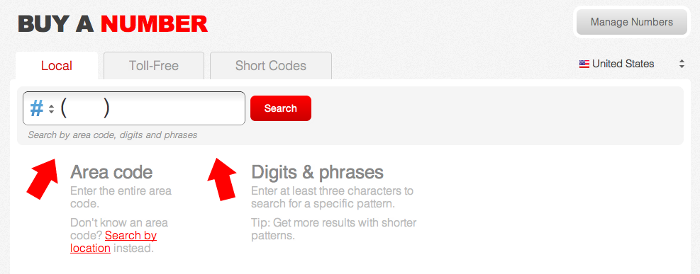

.. _static_apps:

Building Static Applications
=============================

Congratulations! Now that you've built and debugged your first Twilio
application, let's start building Twilio applications with some of the other
TwiML verbs. These applications can be hosted on `Twimlbin`_. 


Call Forwarding
---------------

The `Dial`_ verb allows you to connect calls to other people. The following
TwiML will forward any call received on your Twilio phone number to your 
personal phone number. Once you've wired up this TwiML to your number get a 
neighbor to test it out. 

.. code-block:: xml

    <?xml version="1.0" encoding="UTF-8"?>
    <Response>
      <Say>Please wait while we forward your call.</Say>
      <Dial>YOUR PHONE NUMBER</Dial>
    </Response>

Twilio Call Legs
~~~~~~~~~~~~~~~~~

Find this call in your `Call Logs
<https://www.twilio.com/user/account/log/calls>`_. You should notice two call
records listed. What's the difference between the two call records?

Direction
`````````

For applications like Call Forwarding, your call will include two call legs.
The inbound call leg noted under *Incoming* is the call made into Twilio. The
outbound call leg noted under *Outgoing Dial* is the call made from Twilio with
the Dial verb out to another phone number. Call Forwarding applications include
both an inbound leg and an outbound leg. 

Cost
````

The cost of inbound and outbound calls are different. Inbound calls cost 1¢ per
minute while outbound calls start at 2¢ per minute. The cost of outbound calls
may also differ depending on the end destination of your outbound call. See the
`Voice Pricing`_ Page for more pricing information.

To
``

While the "From" phone numbers are the same, the "To" phone number are
different based on the phone number receiving your call.

Introducing Attributes
------------------------

Each TwiML verb and noun has a set of attributes that allow you to modify its
behavior. Let's change our robot voice to a female voice by adding the `voice
attribute <http://www.twilio.com/docs/api/twiml/say#attributes-voice>`_ and
setting it to "woman". Additionally, let's record our call by including the
`record attribute
<http://www.twilio.com/docs/api/twiml/dial#attributes-record>`_ and mark that
as "true". 

For our last call, the caller ID displayed was the phone number where the call
originated from. Let's change your caller ID using the `callerId attribute
<http://www.twilio.com/docs/api/twiml/dial#attributes-caller-id>`_ so that it
displays your Twilio phone number instead. Earlier we verified your personal
phone number so you may also use that as your caller ID. To use other phone
numbers as your caller ID you can verifying those numbers in your Twilio
Account.

Test out the following code and see how the attributes have changed your
application.

.. code-block:: xml

    <?xml version="1.0" encoding="UTF-8"?>
    <Response>
      <Say voice="woman">Please wait while we forward your call</Say>
      <Dial record="true" callerId="YOUR TWILIO PHONE NUMBER">
        YOUR PHONE NUMBER
      </Dial>
    </Response>

Try out some of the other `Say`_ verb and `Dial`_ verb attributes and see what
they do. 

Voice Mailbox
-------------

Recording audio is accomplished through the `Record`_ verb. The Record verb
will play a beep and wait until a user presses # or hangs up. While the record
attribute used earlier will record both sides of the conversation, the
`Record`_ verb is used to record just the inbound call leg. Copy this TwiML
into your bin and save. You can now leave messages on your number.

.. code-block:: xml

    <?xml version="1.0" encoding="UTF-8"?>
    <Response>
      <Say>After the beep, record your message</Say>
      <Record/>
    </Response>

After you're done recording your message hang up. Twilio begins processing the
recording right after your done. Head to your `recordings log
<https://www.twilio.com/user/account/log/recordings>`_ to listen to your
message.

Transcription
~~~~~~~~~~~~~~

Transcriptions of your recordings can also be made by Twilio with the
`transcribe attribute
<http://www.twilio.com/docs/api/twiml/record#attributes-transcribe>`_

.. code-block:: xml

    <?xml version="1.0" encoding="UTF-8"?>
    <Response>
      <Say>After the beep, record your message</Say>
      <Record transcribe="true"/>
    </Response>

Rerecord your message. This time record a longer message. 

Head over to your `transcription log
<https://www.twilio.com/user/account/log/transcriptions>`_ to see your
transcription and listen to your message.


Private Conference Line
-----------------------

Many times during project assignments you just need to get everyone on the same
page. You can now have your own private conference line using the `Conference`_
noun and `Dial`_ verb. Put the following TwiML into your bin and save.  Give
your Twilio number to a few people around you. Have everyone call in and start
up a conversation.

.. code-block:: xml

    <?xml version="1.0" encoding="UTF-8"?>
    <Response>
      <Dial>
        <Conference>vip</Conference>
      </Dial>
    </Response>


One Song Music Hotline
-----------------------

To play an audio file back to the caller use the `Play`_ verb. We can build a
simple music hotline that just plays just one song to the caller.

.. code-block:: xml

    <?xml version="1.0" encoding="UTF-8"?>
    <Response>
      <Say>You are about to listen to Flight of Young Hearts by Mellotroniac.</Say>
      <Play>http://com.twilio.music.classical.s3.amazonaws.com/Mellotroniac_-_Flight_Of_Young_Hearts_Flute.mp3</Play>
    </Response>


SMS Follow-Up
--------------

Using the `Sms`_ verb you can send SMS messages right after your call has ended. 

.. code-block:: xml

    <?xml version="1.0" encoding="UTF-8"?>
    <Response>
      <Say>I have received your call.</Say>
      <Sms>Thank you for calling.</Sms>
    </Response>

That was easy!

Swiss-Army Phone Number
-----------------------

Equipped with the knowledge of TwiML you can now bend your Twilio phone number
to your will. You've forwarded a call, recorded a message, and started a
private conference line. Your phone is now your's to control.

But with this many applications we definitely want more than one Twilio phone
number. Let's purchase another number.

To purchase a Twilio phone number you will want to navigate to the `Numbers
<https://www.twilio.com/user/account/phone-numbers/incoming>`_ tab. Click on
the blue button titled `Buy a number
<https://www.twilio.com/user/account/phone-numbers/available/local>`_.



You may search for the Twilio phone number you would like to purchase by the
area code, digits, and phrases as well as by the location.

.. _Twimlbin: http://twimlbin.com
.. _Voice Pricing: http://www.twilio.com/voice/pricing
.. _Say: https://www.twilio.com/docs/api/twiml/say
.. _Sms: https://www.twilio.com/docs/api/twiml/sms
.. _Play: https://www.twilio.com/docs/api/twiml/play
.. _Record: https://www.twilio.com/docs/api/twiml/record
.. _Dial: https://www.twilio.com/docs/api/twiml/dial
.. _Conference: https://www.twilio.com/docs/api/twiml/conference
